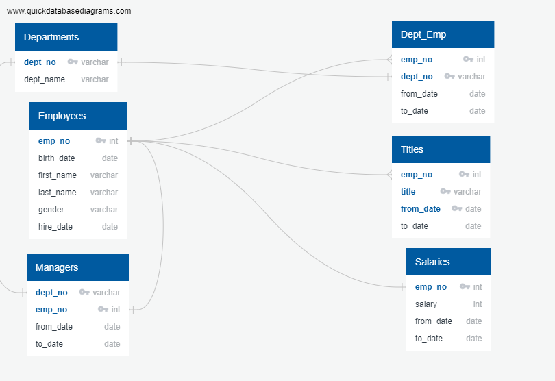
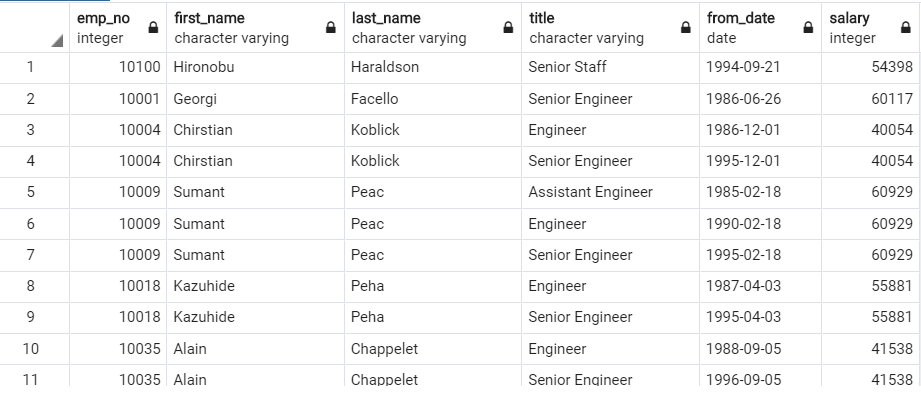
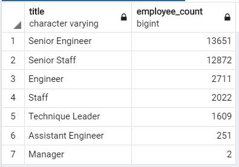
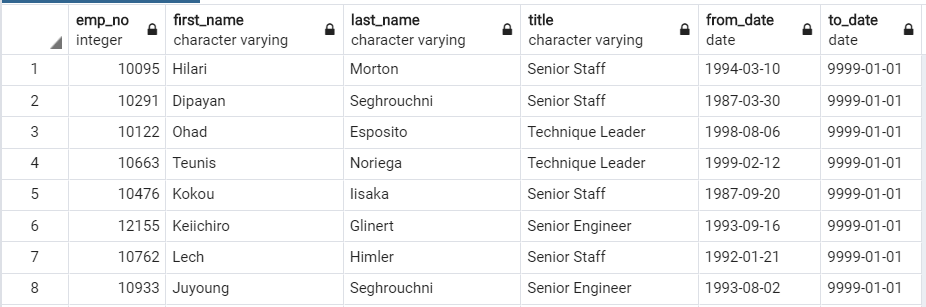

# Pewlett-Hackard-Analysis
## Project Overview
A Pewlett-Hackard company requires its hr analyst to analyze the employee data to perform the following task:
1.	Identify and create the list of employees who will be retiring from the company based on the certain criteria .
2.	Create a list of position which needs to be filled up once the employees retirees.
3.	Create a list of employees who will retire from Sales and Development.
4.	Create a list employees retiring from each department.
## Resources
- Data Source: employees.csv, dept_info.csv, dept_emp.csv, dept_manager.csv, salaries.csv and  titles.csv
- Software: PostgresSQL 11.7, pgAdmin and QuickDatabaseDiagrams
 ## Entity-Relationship-Diagram:
 
 
## Challenge Overview
The challenge's objective was to complete the following task as a part of the Pewlett-Hackard analysis:
1.	Create the list of the retiree who are currently employed in Pewlett-Hackard and their repective titles based on the following criteria:
- Date of birth should be between 1st Jan 1952 - 31st Dec 1955.
2.	Find out the number of employees retiring for various titles .
3. Create a current employee list who are ready for Mentor role.
## Challenge Summary
1. Retiree list : 
- The retiree list and their respective title are as follow :

The actual sql to retrive the above output is as available in the Challenge.sql
2. The number of the employees retiring from various titles (positions) which needs to be filled in future:

The actual sql to retrive the above output is as available in the Challenge.sql

3. The list of employees who are ready for Mentor role are as follows:

The actual sql to retrive the above output is as available in the Challenge.sql

The key insights based on the above data  :
1. The number of current employees who will retire from PH are 33118.
2. The number of employees who are ready for Mentor role are 1549.
3. The number of employees who should be hired in near future will be close to 30000.

Recomendation for future :
1. The employee retirement package will be a huge amount and proper financial plan should be made for this cost to the company.
2. The mentor ready employees should be groomed in such a way that they can be the real assest to the company when the workforce reduction happens due to retirement.
3. Individual department should identify the redundant positions keeping in mind the actual goal of the the company.
